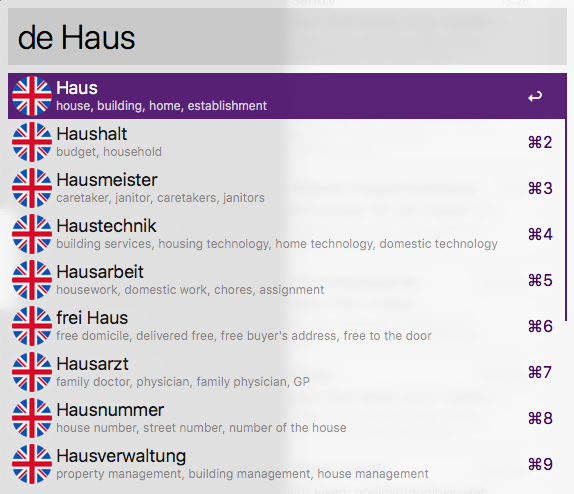

> This repository is not maintained anymore, I can highly recommend [Linguee-Workflow-for-Alfred](https://github.com/sigito/Linguee-Workflow-for-Alfred) as a modern successor.

# Alfred Linguee.de Workflow

*Functionality*

- Autosuggestion
- Supports different languages
- Opens suggestion on linguee.de
- Supports phrases and umlauts

## Download

The latest version of this workflow can be downloaded from [GitHub releases](https://github.com/alexander-heimbuch/linguee-alfred-workflow/releases).

## Extended Use Cases

- Output `meaning`, `phrase` or `url` (default) as an `{query}`
- See workflow settings for examples

## Development

- Checkout in your go source workspace
- Use ``env GOOS=darwin GOARCH=amd64 go build linguee.go`` to compile it
